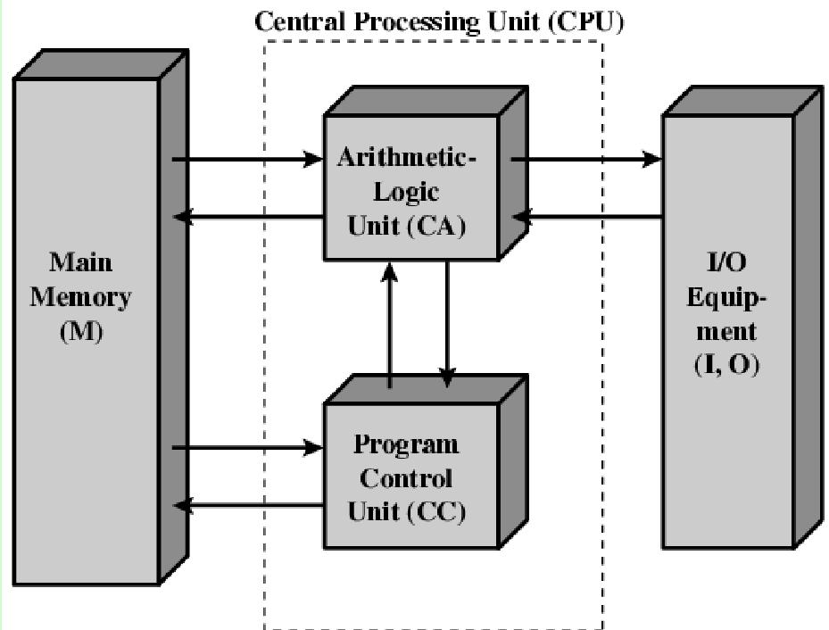

# Class 1 - Intro to Coding

## **Topics**

- **Introduction to the course**
    - Explain course objective and its structure
    - Introduce Mentors and explain their role
    - Show mentor assignments
    - Show material repository
- **What is coding?**
    - [Where does the term "Coding" comes from?](#where-does-the-term-"coding"-comes-from)
    - [Basics of all programming languages](#basics-to-all-programming-languages)
    - What language/s to learn?
    - Tips on how to learn coding

## What is coding?
-----------------

### Where does the term "Coding" comes from?

The term coding is very open ended, and can be defined in several ways, we are going to constrain in to the context of electronic digital Computers, so let us start by defining Computer and Program.

#### **Computer**
[William Stallings](https://en.wikipedia.org/wiki/William_Stallings) defines a Computer as:
> *"An electronic digital **programmable** machine made to automatically process
information. Capable of receiving, operating over and providing the results of such operations"*

<!--  -->

    

The word I highlighted on the definition is the bit that matters to us *coders/programmers/software engineers*,
it means this machine is meant to fullfil many use cases. Is meant to solve any issues that involve processing information from an input to an output.
It archives this by having programs saved in its memory, passing the input to it and then serving the output.

### **Program**
That definition almost completely overlaps with the definition of system.
> *"Organized Components to fullfil a function or set of functions"* - IEEE 610.12-1990

A computer is a system and in the context of a computer a piece of software/program is a logical component of that system. But a program is a system in it of itself.

### **Coding and Programming**
After that very vague and quick set of definitions. This is how 'coding' and 'programming' are defined:

>**Coding is the ability to write instructions from one language to another**

>**Programming is the ability to process, interpret and assemble a set of instructions to machine executable instructions**

From that we can gather that coding and programming are not the same thing,
they are 2 different processes but we are not going to get into that discussion and during this course we will
use them interchangeably and our crude definition will be:

> "The ability to give instructions to a computer"

## Basics to all programming languages
--------------------------------------

Computers are a wonderful miracle when you don't know how they work, and even more when you do.But computers by
themselves are dumb, they can only interpret very specific and simple instructions, they have zero capacity to
interpret the context of your instructions.

For instance, given the instruction:
> _"Go into the shed, grab the shovel and come back"_ in the following context:

    

A computer would:
1. Go to the shed
2. Open the door (and knock the shovel out of the way)
3. Enter the shend
4. Search for and not find the shovel
5. Go back empty handed

This is because at its most basic component a computer is just an incomprehensible amount of logical gates (AND, OR, XOR, etc.) and a lot of rules on how to arrange them to be able to interpret "human instructions".

So... programming languages are used to bridge this immensely simple instructions to a more human readable "code" and like any other language it has syntax and semantics each programming language with their own syntax and semantics. We can summarize it to:

> A Programming Language is a language that is used to write instructions for a computer in a way that it can still be shared and understood by a human.

### **Similarities between languages**

Even though there are literally thousands of programming languages they all provide the same basic set of
[statements](https://en.wikipedia.org/wiki/Statement_(computer_science)).

- **Sequences**
    - Arrangement of 2 blocks in time, the exit of the first block feeds the entry of the second.
- **Selection**
    - Boolean expression statements to select the continuation of the flow.
- **Iteration** *(specification of selection)*
    - Repeated execution of a set of statements until boolean expression is no longer true.

This is much simpler to see with an example, let us say we have the following problem:

>Sam is a professor at the university and likes to round each student's according to these rules:
>   - If the difference between the grade and the next multiple of 5 is less than 3, round up to the next multiple of 5.
>   - If the value of grade is less than 38, no rounding occurs as the result will still be a failing grade. 

How can we make a computer solve it if we imagine the professor typing the grades into a computer and receiving the rounded grade in the screen?

Well I've added one possible algorithm to solve this problem written in [C/C++](/classes//class-1//code/C%20-%20C%2B%2B/StudentsGrader.cpp), [Java](/classes//class-1//code//java/StudentsGrader.java), [Javascript](/classes//class-1//code//javascript/students-grade.js), [PHP](/classes//class-1//code//php//grades-rounder.php), [Powershell](/classes//class-1//code/powershell/round-grades.ps1) and [Python](/classes/class-1/code/python/grades-rounder.py) so you can see that even though there are differences, the same building blocks are being used in all these languages. In the next screenshot I'll highlight the type of statements we discussed before:

That is written in python and "translated" to english it would be something like:

> _"I take the grades, check if they are valid, if so I split them into singular grades and for each one I check if they are less than 38 or a multiple of 5, if so I don't round them, if not I get the next multiple of 5 and round the grade to it."_

## Bibliography / Video courses
- [Powershell eBook](/classes/class-1/bibliography/Powershell%20Course.pdf)
- [Powershell eBook Extension](/classes/class-1/bibliography/Powershell%20Course%20-%20Class%202.pdf)
- [Powershell in Action **Recommended if you really want to get into Powershell**](/classes/class-1/bibliography/Windows_PowerShell_in_Action_Third_Edit.pdf)

### [Return to root](/README.md)
