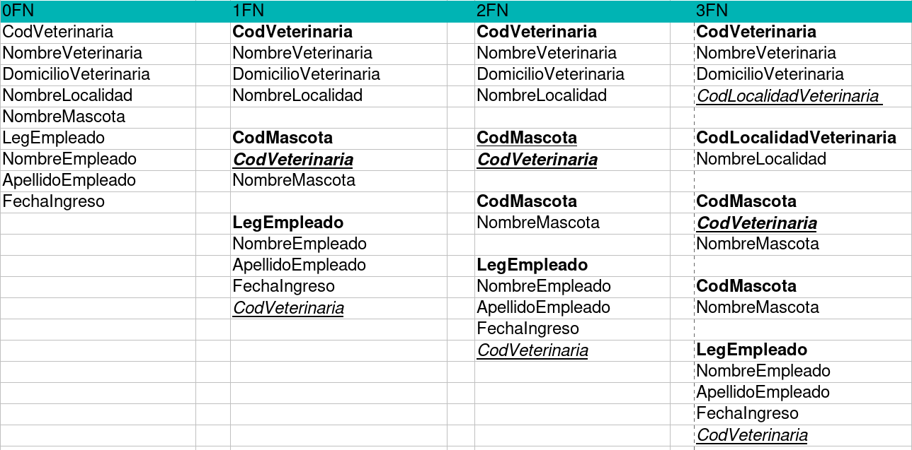
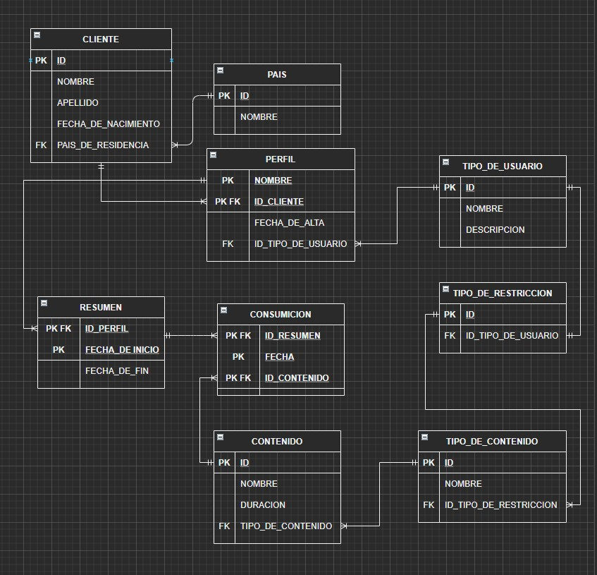

# Class 12 - SQL Part 2

In this class we will discuss how to perform normalization up to the third normal form and what are the best practices when using a relational database as part of your persistance layer.

### Normalization Example
----
 En cada veterinaria se pueden atender varias mascotas.
 Cada mascota se puede atender en varias veterinarias.
 En cada veterinaria trabajan varios empleados.
 Cada empleado solo puede trabajar en una veterinaria.
 Cada veterinaria tiene un solo domicilio y localidad

### DER Example
---

### Bibliography
----------------
[Normalization (Spanish)](/classes/class-12/Normalizaci%C3%B3n.pdf)

[SQL Queries Examples (Spanish)](/classes/class-12/Definici%C3%B3n%20de%20datos%20en%20SQL.pdf)

[Class Material (Spanish)](/classes/class-12/Normalization_tablet.pdf)